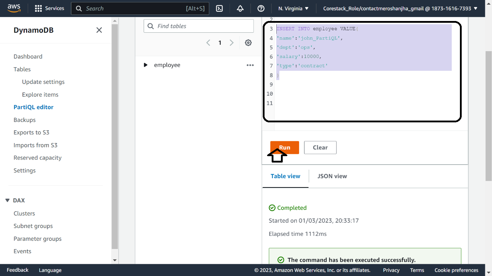

Hands on with Amazon Dynamo DB Database

Course-end Project 1

DESCRIPTION

*You work for a company that requires a fully managed NoSQL database AWS
service that delivers quick, reliable performance, and seamless
scalability. The company wishes to delegate the administration
responsibilities of running and scaling a distributed database, so you
don\'t have to deal with hardware provisioning, setup, configuration,
replication, software patching, or cluster scaling. They\'d also like to
make sure that the data is encrypted.*

*To accomplish the following, you\'ll need to use the DynamoDB service
in your AWS lab. You must create a database table with DynamoDB, that
can store and retrieve any amount of data and handle any number of
traffic requests. You can increase or decrease the throughput capacity
of your tables without experiencing any downtime or performance
reduction.*

**Expected Deliverables:**

1)  Create a table.

2)  Write data to the table using the Console .

3)  Read data from the table .

4)  Update data in the table .

5)  Query data in the table.

6)  Clean up resources.

**Solution:**

For the demo purpose let's have a set of data to work upon,

That is - \> ***6 items*** to be inserted into the DynamoDB table
**employee** :

**\-\-\-\-\-\--ITEM-1\-\-\-\--**

**{**

**\"name\":\"dorothy\",**

**\"dept\":\"support\",**

**\"salary\":18000,**

**\"type\":\"contract\"**

**}**

**\-\-\-\-\-\--ITEM-2\-\-\-\--**

**{**

**\"name\":\"ramesh\",**

**\"dept\":\"dev\",**

**\"salary\":58000,**

**\"type\":\"regular\"**

**}**

**\-\-\-\-\-\--ITEM-3\-\-\-\--**

**{**

**\"name\":\"jaya\",**

**\"dept\":\"ops\",**

**\"salary\":22000,**

**\"type\":\"contract\"**

**}**

**\-\-\-\-\-\--ITEM-4\-\-\-\--**

**{**

**\"name\":\"shamshi\",**

**\"dept\":\"dev\",**

**\"salary\":48000,**

**\"type\":\"regular\"**

**}**

**\-\-\-\-\-\--ITEM-5\-\-\-\--**

**{**

**\"name\":\"ravi\",**

**\"dept\":\"support\",**

**\"salary\":18000,**

**\"type\":\"contract\"**

**}**

**\-\-\-\-\-\--ITEM-6\-\-\-\--**

**{**

**\"name\":\"ravi\",**

**\"dept\":\"dev\",**

**\"salary\":60000,**

**\"type\":\"regular\"**

**}**

1)  **Creating a table.**

-   1^st^ we create table with the following criteria :

PRIMARY INDEX at the start of table creation :

-   table name - **employee**

-   PARTITION KEY - **name**

-   SORT KEY -- **dept**

AS PER REQUIREMENT :

-   PROVISIONING , SETUP , CONFIGURATION, REPLICATION, PATHCING, CLUSTER
    SCALING \-- AUTOMATICALLY AVAILABLE WITH DYNAMODB

```{=html}
<!-- -->
```
-   TO SATISFY ENCRYPTED \--

    -   WHEN CREATING TABLE\--

    -   choose ENCRYPTION AT REST \-- let that be AWS MANAGED for our
        demo purpose .

```{=html}
<!-- -->
```
-   TO SATISFY INCREASE/DECREASE THROUGHPUT CAPACITY WITHOUT DOWNTIME OR
    PERFORMANCE \-- WHEN CREATING TABLE,

    -   UNDER READ WRITE CAPACITY SETTINGS :

    -   We need to choose PROVISIONED (REQUIRED rcu /wcu) or ONDEMAND ,
        so ONDEMAND is the right option as per the requirement .

TABLE CREATION Screenshots :

{width="6.268055555555556in"
height="2.7720877077865267in"}
{width="6.268055555555556in"
height="3.5246456692913384in"}
{width="6.268055555555556in"
height="1.8145384951881014in"}
{width="6.268055555555556in"
height="1.6152438757655294in"}

-   Later in future we needed to know \"salary\" by "name"(regular or
    contract), so for this access pattern we will create GLOBAL
    SECONDARY INDEX with its name **GSI_namesalary**,

Where:

> PARTITION KEY -- name (of string data type )
>
> SORT KEY -- salary ( of number data type)
>
> **It will take a while to create the GSI table to become active.**

{width="6.268055555555556in"
height="3.5246456692913384in"}
{width="6.268055555555556in"
height="3.5246456692913384in"}

{width="6.268055555555556in"
height="2.7729166666666667in"}

2)  **Writing data to the table using the Console .**

> We can use the normal JSON viewer in the management console and we can
> insert our items one by one . OR ELSE we can also use the
> **PartiQL**(SQL like statements developed by AWS ) to
> read/insert/edit/update the data.
>
> **AWS MANAGEMENT CONSOLE WAY:**
>
> {width="6.268055555555556in"
> height="3.3270833333333334in"} {width="6.268055555555556in"
> height="1.8625in"}
>
> {width="6.268055555555556in"
> height="3.5246456692913384in"}
>
> {width="6.268055555555556in"
> height="2.7969313210848643in"}
>
> **PartiQL Statements WAY:**
>
> Go to **PartiQL editor - \>** RIGHT CLICK on table name and choose
> ***scan** **table ***
>
> *OR write the statement (* just check remove double inverted commas (
> " ) with single inverted comma( ' ) **:**
>
> **INSERT INTO employee VALUE{**
>
> **\'name\':\'john_PartiQL\',**
>
> **\'dept\':\'ops\',**
>
> **\'salary\':10000,**
>
> **\'type\':\'contract\'**
>
> **}**
>
> Drag and select this statement and click RUN.
>
> {width="6.268055555555556in"
> height="3.5246456692913384in"}
>
> AND CHECK the table again with full table scan: **SELECT \* FROM
> "employee"**
>
> Screenshots below :
>
> {width="6.268055555555556in"
> height="3.1378685476815398in"}
> {width="6.268055555555556in"
> height="3.5246456692913384in"}

3)  **Reading data from the table .**

> We choose the *scan* option to see all the data . But it is a very
> computationally inefficient (as it *scans* across all the partitions
> )and hence is the costly way . But later in QUERY we will use
> PARTITION KEY , SORT KEY for more efficient way .
>
> **AWS MANAGEMENT CONSOLE WAY:**
>
> {width="6.268055555555556in"
> height="3.5246456692913384in"}
>
> **PartiQL Statements WAY:**
>
> Go to **PartiQL editor - \>** RIGHT CLICK on table name and choose
> ***scan** **table ***
>
> ***OR write the statement :***
>
> **SELECT \* FROM "employee"**
>
> Drag and select this statement and click RUN.
>
> Screenshots below :
>
> {width="6.268055555555556in"
> height="3.5246456692913384in"}
> {width="6.268055555555556in"
> height="3.5246456692913384in"}

4)  **Updating data in the table .**

> Let's change the *type* of ***jaya*** from ***contract*** to
> ***regular*** with **PartiQL editor** and change the ***type*** of
> ***dorothy*** to ***regular** from **contract*** in the **AWS
> MANAGEMENT CONSOLE***.* We can't update the PARTITION KEY (name ) and
> SORT KEY (dept) as this is to be thought out at the the table creation
> with access patterns of business in mind.
>
> **AWS MANAGEMENT CONSOLE WAY:**
>
> {width="6.255354330708661in"
> height="3.2772397200349954in"}
>
> {width="6.267708880139982in"
> height="2.765277777777778in"}
> {width="6.267584208223972in"
> height="2.7597222222222224in"}
>
> **PartiQL Statements WAY:**
>
> Go to **PartiQL editor - \>** RIGHT CLICK on table name and choose
> ***query** **table OR write the statement : ***
>
> **UPDATE employee SET type=\'regular\'**
>
> **WHERE name=\'jaya\' and dept=\'ops\'**
>
> **RETURNING ALL NEW \***
>
> Drag and select this statement and click RUN.
>
> {width="6.268055555555556in"
> height="3.5246456692913384in"}
>
> AND CHECK the table again with full table scan: **SELECT \* FROM
> "employee"**
>
> {width="6.276106736657918in"
> height="2.6306922572178477in"}

5)  **Query data in the table.**

> Using PARTION KEY(name) as "ravi" and SORT KEY(dept) as "dev", we are
> able to narrow down the results to its unique value(which otherwise
> without the SORT KEY gives multiple results).
>
> **AWS MANAGEMENT CONSOLE WAY:**
>
> {width="6.268055555555556in"
> height="3.5246456692913384in"}
>
> **PartiQL Statements WAY:**
>
> Go to **PartiQL editor - \>** RIGHT CLICK on table name and choose
> ***query** **table OR write the statement : ***
>
> **SELECT \* FROM employee WHERE name=\'ravi\' and dept=\'dev\';**
>
> Drag and select this statement and click RUN.
>
> {width="6.268055555555556in"
> height="3.5246456692913384in"}
>
> {width="6.268055555555556in"
> height="3.5246456692913384in"}

6)  **Checking and testing the created GSI table .**

> Going back to table name , up above clicking the VIEW TABLE DETAILS .
> From many tabs go to the INDEXES tab . We observer our GSI index -
> **GSI_namesalary** , its STATUS column showing ACTIVE.
>
> Going now to the QUERY within our main table **employee.** Now we will
> be presented with new table name **GSI_namesalary** other than what
> was shown earlier (**employee**).
>
> Accordingly as per **GSI_namesalary** we are shown :
>
> PARTITION KEY as *[name]{.underline}*,
>
> And , SORT KEY as *[salary]{.underline}* .

-   So now putting PARTITION KEY (*[name]{.underline}* as *ravi)*

-   *And* PARTITION KEY : *[salary]{.underline}* as some **number***,*
    along with expression GREATER THAN **10000(giving 2 results )** and
    also trying the expression GREATER THAN **20000(giving only 1
    result).**

{width="6.268055555555556in"
height="1.6996806649168854in"}

{width="6.268055555555556in"
height="3.5246456692913384in"}

{width="6.268055555555556in"
height="3.5246456692913384in"}{width="6.268055555555556in"
height="3.5246456692913384in"}

{width="6.268055555555556in"
height="3.5246456692913384in"}

7)  **Clean up resources.**

> **Simply deleting the table from the table view.**
>
> {width="6.268055555555556in"
> height="2.7305555555555556in"}
>
> {width="6.268055555555556in"
> height="1.5138888888888888in"}
>
> {width="6.268055555555556in"
> height="1.8458333333333334in"}

THE END. THANK YOU.
